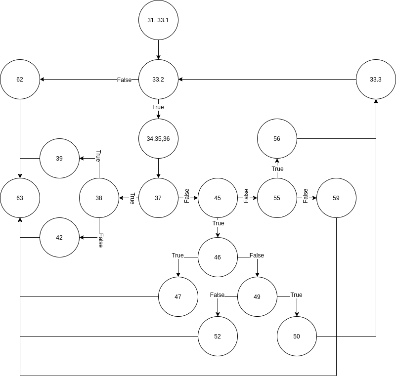

# Втора лабораториска вежба по Софтверско инженерство

## Давид Гичев, бр. на индекс 196034

###  Control Flow Graph

### Цикломатска комплексност

Цикломатската комплексност на овој код е 7. Ова може да се пресмета со собирање на бројот на предикатни јазли со 1, или со користење на формулата
E - N + 2\*P
Каде Е = 24, N = 19, P = 1

### Тест случаи според критериумот Multiple Condition

`(hr < 0 || hr > 24)`
Комбинации | Тестови
--|--
TX | Time(-1, 0, 0)
FT | Time(26, 0, 0)
FF | Time(10, 0, 0)

`(hr < 24)`
Комбинации | Тестови
--|--
T | Time(-1, 0, 0)
F | Time(26, 0, 0)

`(hr < 0)`
Комбинации | Тестови
--|--
T | Time(-1, 0, 0)
F | Time(26, 0, 0)

`(min < 0 || min > 59)`
Комбинации | Тестови
--|--
TX | Time(0, -1, 0)
FT | Time(0, 100, 0)
FF | Time(10, 0, 0)

`(sec >= 0 && sec <= 59)`
Комбинации | Тестови
--|--
TT | Time(10, 0, 0)
TF | Time(0, 0, 100)
FX | Time(0, 0, -1)

`(hr == 24 && min == 0 && sec == 0)`
Комбинации | Тестови
--|--
TTT | Time(24, 0, 0)
TTF | Time(24, 0, 10)
TFX | Time(24, 10, 0)
FXX | Time()

### Тест случаи според критериумот  Every branch 

.... 

### Објаснување на напишаните unit tests

...
...
